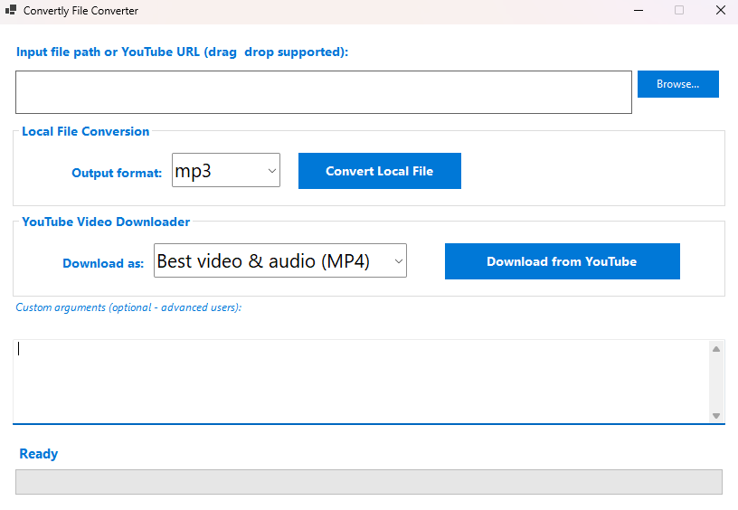
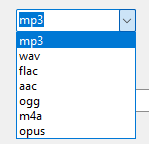
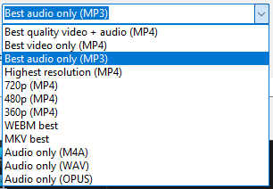

# Convertly File Converter (Windows)



---

**Convertly File Converter** is a file converter program developed for Windows. It embeds ffmpeg and yt-dlp into one single bundle supported by a GUI for easy use. This way users can convert files and download from YouTube.




## Development

If you would like to futher develop the project, you can download the code as .zip. Make sure you have the .NET framework downloaded as the project is programmed in C#.

Additionally, you will have to download the ffmpeg.exe and yt-dlp.exe files from their websites and place them in your root folder.

1. Download the latest Windows binaries:
   - FFmpeg: https://www.gyan.dev/ffmpeg/builds/ (choose "full" build → extract `ffmpeg.exe` from bin folder)
   - yt-dlp: https://github.com/yt-dlp/yt-dlp/releases (download `yt-dlp.exe`)
2. Make sure config.json correctly matches the files names described above.

If you made changes and want to deploy it you can run the following:

```bash
dotnet clean
```

```bash
dotnet publish ConvertlyFileConverter.csproj -c Release -r win-x64 --self-contained true -p:PublishSingleFile=true -p:IncludeNativeLibrariesForSelfExtract=true
```

The output exe can be found in:
**bin\Release\net10.0-windows\win-x64\publish**

## Support

We will do our best to maintain and add updates in the near future. We are planning on adding more, but you are more than welcome to copy and use this project for yourself as well as publish it.

## Credits & Third-Party Tools

This application uses the following external tools:

- **[yt-dlp](https://github.com/yt-dlp/yt-dlp)** – Licensed under the Unlicense (public domain).  
  A feature-rich command-line audio/video downloader.

- **[FFmpeg](https://ffmpeg.org)** – Licensed under the LGPL v2.1 (with some optional GPL parts).  
  A complete, cross-platform solution to record, convert and stream audio and video.

Both tools are bundled as standalone executables and executed externally.

## License

This project is licensed under the MIT License - see the [LICENSE](LICENSE) file for details.
